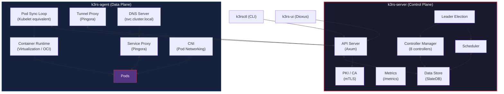

# K3rs: A Lightweight Scheduling & Orchestration Platform

## Overview
This document outlines the design and architecture for a new Scheduling & Orchestration system written in Rust (`k3rs`). It is heavily inspired by the minimal, edge-focused architecture of [K3s](https://k3s.io/). A core differentiator of this project is the extensive integration of [Cloudflare Pingora](https://github.com/cloudflare/pingora) as the primary engine for networking, proxying, and API routing, and [SlateDB](https://slatedb.io/) as the embedded state store built on object storage.

## Goals
- **Minimal Footprint**: Single binary execution for both Server and Agent, similar to the K3s model.
- **High Performance & Safety**: Built natively in Rust for memory safety and extreme performance.
- **Advanced Networking**: Integration of Pingora for all Layer 4/Layer 7 routing and reverse tunneling, with [Axum](https://docs.rs/axum/0.8.8/axum/) powering the high-performance HTTP API.
- **Edge Native**: Designed for resource-constrained environments, IoT, and Edge Computing scenarios.
- **Zero-Ops Storage**: Leverage object storage (S3/R2/MinIO) via SlateDB to eliminate the need for managing a separate database cluster.
- **Modern Ecosystem**: Always use the **latest versions** of Rust crates and libraries (e.g., Axum, Pingora, SlateDB) to benefit from the latest security, performance, and features.

## Architecture Structure

The system follows a classical **Control Plane (Server)** and **Data Plane (Agent)** architecture with strict separation of concerns. The Server **does not** run containers — all container lifecycle management is performed by the Agent.

> **Fail-Static Principle**: Restarting or crashing any component must **never** disrupt running workloads. Containers continue to run on Agent nodes regardless of Server or Agent process state. See [Fail-Static Guarantees](#fail-static-guarantees) for the full specification.



### 1. Server Components (Control Plane)
The server binary encapsulates **only** control plane processes. It does not run containers or manage container runtimes:
- **API Server (powered by Axum)**: The central entry point for all control plane communications. Handles Agent registration, workload definitions, and API requests using the ergonomic, high-performance Axum web framework.
- **Scheduler**: Determines which node (Agent) a workload should run on, based on resource availability, node labeling, affinity/anti-affinity rules, taints, and tolerations.
- **Controller Manager**: Runs background control loops to maintain the desired state of the cluster (e.g., node liveness, workload deployments, replica count, auto-scaling). Controllers only manage desired state — they create/delete Pod records, but the Agent is responsible for the actual container lifecycle.
- **Data Store (SlateDB)**: Embedded key-value database built on object storage using [SlateDB](https://slatedb.io/) for robust, cost-effective, and highly available state persistence. Eliminates the need for etcd or an external database.
- **Leader Election**: Ensures only one Server runs Scheduler + Controllers in multi-server HA mode.
- **PKI / CA**: Issues mTLS certificates to Agents on registration.

### 2. Agent Components (Data Plane)
The agent binary runs on worker nodes and executes workloads:
- **Tunnel Proxy (powered by Pingora)**: Maintains a persistent, secure reverse tunnel back to the Server (similar to K3s). Pingora's connection pooling and multiplexing capabilities make it ideal for managing these reverse tunnels dynamically without dropping packets.
- **Pod Sync Loop (Kubelet equivalent)**: Watches for Scheduled pods, pulls images, creates and starts containers, monitors health, and reports status back to the Server API.
- **Container Runtime Integrator**: Platform-aware container runtime with pluggable backends — Virtualization.framework microVM on macOS (Firecracker-like lightweight Linux VMs), OCI runtimes (`youki`/`crun`) with auto-download from GitHub Releases on Linux. Pulls OCI images via `oci-client`, extracts rootfs layers, boots minimal Linux VMs or OCI containers, and manages full container lifecycle including exec.
- **Service Proxy (powered by Pingora)**: Replaces `kube-proxy`. Uses Pingora to dynamically manage advanced L4/L7 load balancing for services running on the node, routing traffic seamlessly to the correct local or remote Pods.
- **DNS Server**: Lightweight embedded DNS resolver for `<service>.<namespace>.svc.cluster.local` resolution.
- **Overlay Networking (CNI)**: Manages pod-to-pod networking and IP allocation (similar to Flannel or Cilium).

### 3. CLI Tool (`k3rsctl`)
A command-line interface for cluster management:
- **Cluster Operations**: `k3rsctl cluster info`, `k3rsctl node list`, `k3rsctl node drain <node>`
- **Workload Management**: `k3rsctl apply -f <manifest>`, `k3rsctl get pods`, `k3rsctl logs <pod>`
- **Debugging**: `k3rsctl exec <pod> -- <command>`, `k3rsctl describe <resource>`
- **Configuration**: `k3rsctl config set-context`, kubeconfig-compatible credential management
- Communicates with the API Server via gRPC/REST with token-based authentication.

### 4. Management UI (`k3rs-ui`) — powered by [Dioxus 0.7](https://dioxuslabs.com/learn/0.7/)
A web-based management dashboard built with [Dioxus](https://dioxuslabs.com/learn/0.7/), a Rust-native fullstack UI framework:
- **Dashboard**: Real-time cluster overview — node count, pod status, resource utilization, and recent events.
- **Node Management**: View nodes, status, labels, taints. Drain/cordon operations.
- **Workload Management**: Browse/create/delete Pods, Deployments, Services, ConfigMaps, Secrets.
- **Namespace Viewer**: Switch between namespaces, view resource quotas.
- **Ingress & Networking**: Configure Ingress rules, view Endpoints, DNS records.
- **Events Stream**: Live-updating event feed from the watch/event stream (SSE).
- **Built with Dioxus Web**: Ships as a WASM SPA, served by the API Server or standalone via `dx serve`. Uses RSX syntax (HTML/CSS), typesafe Dioxus Router, and reactive signals for state management.

## Security & Authentication

### Node Join & Identity
- **Join Token**: Agents register with the Server using a pre-shared join token (generated at server init or via `k3rsctl token create`).
- **Node Certificate**: Upon successful registration, the Server issues a unique TLS certificate to the Agent for all subsequent communication.

### Transport Security
- **mTLS Everywhere**: All Server ↔ Agent and Agent ↔ Agent communication is encrypted with mutual TLS. Certificates are automatically rotated via a built-in lightweight CA.
- **API Authentication**: API requests are authenticated via short-lived JWT tokens or client certificates.

### Access Control
- **RBAC**: Role-Based Access Control for API operations. Built-in roles: `cluster-admin`, `namespace-admin`, `viewer`.
- **Service Accounts**: Workloads receive scoped service account tokens for API access.

## SlateDB Data Model

SlateDB is used as the sole state store, replacing etcd. All cluster state is stored as key-value pairs with a structured key prefix scheme.

### Key Prefix Design

All resource keys use **name** as the primary identifier (K8s-style), not UUID.
Names must be `[a-z0-9-]`, max 63 characters, no leading/trailing hyphens (RFC 1123).
UUIDs are stored as `.id` fields for internal reference only.

```
/registry/nodes/<node-name>                        → Node metadata & status (id = UUID)
/registry/namespaces/<ns>                          → Namespace definition
/registry/pods/<ns>/<pod-name>                     → Pod spec & status
/registry/services/<ns>/<service-name>             → Service definition
/registry/endpoints/<ns>/<endpoint-name>           → Endpoint slice
/registry/deployments/<ns>/<deployment-name>       → Deployment spec & status
/registry/replicasets/<ns>/<rs-name>               → ReplicaSet spec & status
/registry/configmaps/<ns>/<cm-name>                → ConfigMap data
/registry/secrets/<ns>/<secret-name>               → Secret data (encrypted at rest)
/registry/rbac/roles/<ns>/<role-name>              → Role definitions
/registry/rbac/bindings/<ns>/<binding-name>        → RoleBinding definitions
/registry/leases/<lease-id>                        → Leader election leases
/events/<ns>/<timestamp>-<event-id>                → Cluster events (TTL-based)
```

#### Name Validation (`pkg/types/src/validate.rs`)
- [x] `validate_name(name) -> Result<()>` — `[a-z0-9-]`, max 63 chars, no leading/trailing `-`
- [x] Resource uniqueness: `(namespace, name)` pair must be unique
- [x] Unit tests: valid names + invalid names (uppercase, underscore, leading hyphen, too long)

### Object Storage Backends
- **Amazon S3** / **S3-compatible** (MinIO, Ceph RGW)
- **Cloudflare R2**
- **Local filesystem** (development/single-node mode)

### Consistency & Watch
- **Read-after-write consistency**: Guaranteed by SlateDB's LSM-tree with WAL on object storage.
- **Watch mechanism**: Server maintains an in-memory event log with sequence numbers. Clients (Agents, Controllers) subscribe to change streams filtered by key prefix — similar to etcd watch but implemented at the application layer.
- **Compaction**: SlateDB handles background compaction automatically. TTL-based keys (events, leases) are garbage-collected during compaction.

## Namespaces & Multi-tenancy

- **Namespaces**: Logical grouping for workloads, services, and configuration. Default namespace: `default`. System components run in `k3rs-system`.
- **Resource Quotas**: Per-namespace CPU, memory, and pod count limits.
- **Network Policies**: Namespace-level network isolation rules enforced by the Service Proxy.

## Service Discovery & DNS

- **Embedded DNS Server**: Lightweight DNS resolver using [Hickory DNS](https://github.com/hickory-dns/hickory-dns) embedded in each Agent node.
- **Service DNS Records**: Automatically created when a Service is registered.
  - `<service>.<namespace>.svc.cluster.local` → ClusterIP
  - `<pod-name>.<service>.<namespace>.svc.cluster.local` → Pod IP (headless services)
- **DNS Sync**: Server pushes DNS record updates to Agents via the watch/event stream.

## Workload & Deployment Model

### Primitives
- **Pod**: The smallest deployable unit — one or more containers sharing the same network namespace.
- **Deployment**: Declarative desired-state controller managing ReplicaSets and rolling updates.
- **ReplicaSet**: Ensures a specified number of Pod replicas are running at any given time.
- **DaemonSet**: Ensures a Pod runs on every (or selected) node(s).
- **Job / CronJob**: One-off or scheduled batch workloads.
- **Service**: Stable networking abstraction (ClusterIP, NodePort, LoadBalancer).
- **ConfigMap / Secret**: Configuration and sensitive data injection into Pods.

### Deployment Strategies
- **Rolling Update**: Gradually replace old Pods with new ones, configurable `maxSurge` and `maxUnavailable`.
- **Recreate**: Terminate all old Pods before creating new ones.
- **Blue/Green** (future): Traffic switch via Service Proxy once new version is healthy.
- **Canary** (future): Weighted traffic splitting via Pingora's programmable routing.

## Auto-scaling

### Horizontal Pod Autoscaler (HPA)
- Scale workload replicas based on CPU/memory utilization or custom metrics.
- Agents report resource metrics to the Server at regular intervals.
- The Controller Manager evaluates scaling rules and adjusts replica counts.

### Cluster Autoscaler (future)
- Integration hooks for cloud providers to add/remove nodes based on scheduling pressure.

## Observability

### Metrics
- **Prometheus-compatible endpoints**: Both Server and Agent expose `/metrics` endpoints.
- **Built-in metrics**: Node resource usage, Pod status, API latency, Pingora proxy stats (connections, throughput, error rates).

### Logging
- **Container log streaming**: `k3rsctl logs <pod>` streams stdout/stderr from containers via the Agent.
- **Structured logging**: All k3rs components emit structured JSON logs with configurable verbosity levels.

### Tracing (future)
- **OpenTelemetry integration**: Trace API requests through the Server → Scheduler → Agent → Container lifecycle.
- **Pingora request tracing**: End-to-end trace IDs for all proxied requests.

## Persistent Storage (future)

### Volume Management
- **HostPath Volumes**: Mount a directory from the host node into a container.
- **CSI Plugin Interface**: Pluggable Container Storage Interface for third-party storage providers.
- **Volume Claims**: Declarative volume requests attached to workload specs.

## High Availability

### Multi-Server Mode
- Multiple Server instances can run simultaneously for HA.
- **Leader Election**: Using SlateDB lease keys with TTL-based expiry. Only the leader runs the Scheduler and Controller Manager; all servers can serve API requests.
- **Object Storage as shared state**: Since SlateDB uses object storage as its backend, all servers share the same state naturally — no Raft/Paxos needed for data replication.

### Failure Recovery
- **Agent reconnection**: If the Server restarts, Agents automatically reconnect via the Tunnel Proxy with exponential backoff.
- **Workload rescheduling**: If a node becomes unavailable (missed health checks), the Controller Manager reschedules its workloads to healthy nodes after a configurable grace period.

## Fail-Static Guarantees

The system is designed to be **fail-static**: running workloads **must** continue executing even when control plane or agent processes crash or restart. No component failure may cause previously-healthy containers to stop.

### Server Restart Resilience

Restarting `k3rs-server` has **zero impact** on running Pods:

| Component | During Server Downtime | After Server Restart |
|---|---|---|
| **Running Containers** | ✅ Continue running on Agent nodes | ✅ No restart needed |
| **Service Proxy (Pingora)** | ✅ Continues routing traffic | ✅ Reconnects route sync |
| **DNS Server** | ✅ Continues resolving cached records | ✅ Refreshes from new sync |
| **Agent Container Runtime** | ✅ Fully independent | ✅ No state change |
| **Scheduling** | ❌ Paused (no new pod placement) | ✅ Resumes immediately |
| **Controllers** | ❌ Paused (no reconciliation) | ✅ Catch up via level-triggered reconcile |
| **API** | ❌ Unavailable | ✅ Available immediately |

**Agent behavior**: Agents detect Server disconnection and retry with **exponential backoff** (1s → 2s → 4s → 8s → capped at 30s). Existing workloads are unaffected during the entire retry window.

### Agent Crash Resilience

Restarting or crashing `k3rs-agent` **must not** terminate running containers:

**Container Process Independence** (MANDATORY):

- Container processes **must not** be children of the Agent process tree. If the Agent is killed (`SIGKILL`), container processes must continue running.
- **OCI Runtime**: Containers spawned via `youki`/`crun` are already independent — the OCI runtime `create` + `start` detaches the container process from the caller.
- **MicroVM (Virtualization.framework / Firecracker)**: VM processes must be **double-forked** or launched via a helper so they are not reaped when the Agent exits.
- **Invariant**: `kill -9 <agent-pid>` must **never** cause any container to stop.

**Data Plane Continuity** (during Agent downtime):

| Component | During Agent Crash | After Agent Restart |
|---|---|---|
| **Running Containers** | ✅ Continue running (independent processes) | ✅ Reconciled by pod sync loop |
| **Service Proxy (Pingora)** | ❌ Stops (runs in-process) | ✅ Restarts with cached routes |
| **DNS Server** | ❌ Stops (runs in-process) | ✅ Restarts, rebuilds from Server sync |
| **Pod Networking** | ✅ Existing connections continue | ✅ IP allocations restored from state |
| **Heartbeat** | ❌ Stops → Server marks node NotReady/Unknown | ✅ Resumes, node transitions back to Ready |

> **Trade-off**: Service Proxy and DNS run in-process with the Agent for simplicity. During an Agent crash, new service discovery and load balancing are temporarily unavailable, but existing TCP connections to pods continue working because containers and their network stacks are independent.

### Agent Recovery Procedure

When the Agent restarts after a crash, it **must** perform the following recovery steps in order:

1. **Discover Running Containers**
   - Query the OCI runtime for all containers in running state: `<runtime> list --format json`
   - For MicroVMs, scan for running VM processes (PID files or process list)
   - Build an in-memory map of `container_id → pod` from runtime state

2. **Reconcile with Server State**
   - Fetch desired pod list from Server API: `GET /api/v1/pods?fieldSelector=spec.nodeName=<self>`
   - Compare actual (discovered) vs desired (Server) state
   - **Running and desired**: Adopt — update internal tracking, resume health monitoring
   - **Running but NOT desired**: Stop — container was deleted while Agent was down
   - **Desired but NOT running**: Create — container crashed independently while Agent was down

3. **Restore Networking**
   - Rebuild IP allocation table from discovered containers
   - Restart Service Proxy with current service/endpoint state from Server
   - Restart DNS server with current service records

4. **Resume Normal Operation**
   - Resume heartbeat loop
   - Resume pod sync loop (periodic reconciliation)
   - Resume route sync loop (service proxy updates)

**Idempotency**: Every step must be **idempotent** — the same recovery procedure runs regardless of whether the Agent crashed, was gracefully restarted, or is starting for the first time.

### Design Invariants

1. **No container is a child of the Agent** — Agent crash ≠ container crash
2. **No persistent lock files** — Agent restart does not block on stale locks
3. **Level-triggered reconciliation** — Agent does not rely on missed events; it always compares full actual vs desired state
4. **Server is stateless w.r.t. runtime** — Server never holds container runtime handles or references
5. **Idempotent recovery** — Running the recovery procedure on a healthy Agent is a no-op

### Implementation Checklist

#### Container Process Independence
- [ ] OCI backend (`youki`/`crun`): Verify `create` + `start` fully detaches container process from Agent PID tree
- [ ] OCI backend: Write integration test — `kill -9 <agent-pid>` → verify container still running via `<runtime> state <id>`
- [ ] VirtualizationBackend (macOS): Launch `k3rs-vmm` helper via double-fork or `setsid()` so VM outlives Agent
- [ ] FirecrackerBackend (Linux): Ensure Firecracker VMM process is not child of Agent (use Jailer or double-fork)
- [ ] PID file management: Write VM/container PID to `/var/run/k3rs/containers/<id>/pid` for discovery after restart

#### Agent Recovery
- [ ] `discover_running_containers()` — query OCI runtime `list` command, parse running container IDs
- [ ] `discover_running_vms()` — scan PID files under `/var/run/k3rs/containers/`, verify process alive
- [ ] `reconcile_with_server(discovered, desired)` — adopt/stop/create logic
- [ ] `restore_ip_allocations(discovered_containers)` — rebuild `PodNetwork` state from running containers
- [ ] Refactor Agent boot sequence: use recovery procedure as the **default startup path** (idempotent — works for fresh start and crash recovery)
- [ ] Add `GET /api/v1/pods?fieldSelector=spec.nodeName=<name>` endpoint on Server for node-scoped pod queries

#### Server Resilience
- [x] Remove `ContainerRuntime` from Server — Server is pure Control Plane
- [x] Remove server lock file system (lock file write/cleanup, colocation guard)
- [x] Update dev scripts (`dev.sh`, `dev-agent.sh`) — remove colocation flags
- [ ] Agent exponential backoff on Server disconnect (1s → 2s → 4s → … → 30s cap)
- [ ] Agent: continue running containers + Service Proxy + DNS when Server unreachable

#### Networking Recovery
- [ ] Service Proxy: cache last-known routing table to disk (`/var/run/k3rs/routes.json`) for fast restart
- [ ] DNS Server: cache last-known service records to disk (`/var/run/k3rs/dns-records.json`) for fast restart
- [ ] On Agent restart: load cached routes/records immediately → serve stale while syncing fresh from Server

#### Testing & Validation
- [ ] Test: kill Agent → verify containers still running → restart Agent → verify pod adoption
- [ ] Test: kill Server → verify Agent continues serving traffic → restart Server → verify reconnection
- [ ] Test: kill Agent + Server simultaneously → restart both → verify full cluster recovery
- [ ] Test: Agent starts fresh (no prior containers) → verify normal boot path works (idempotent recovery)

## Why Cloudflare Pingora?
Using Cloudflare Pingora as the backbone for this orchestrator provides several architectural advantages:
- **Memory-Safe Concurrency**: Pingora handles millions of concurrent connections efficiently, avoiding memory leaks typical in C-based proxies.
- **Unified Proxying Ecosystem**: It replaces multiple discrete components (Ingress Controller, Service Proxy, Tunnel Proxy) with a single unified, programmable Rust framework embedded directly into the binary, working alongside Axum for API endpoints.
- **Dynamic Configuration**: Pingora allows hot-reloading of routing logic and proxy rules without dropping existing connections, which is crucial for a fast-churning orchestration environment where services are constantly scaling.
- **Protocol Flexibility**: Native support for HTTP/1.1, HTTP/2, TLS, and Raw TCP/UDP streams, making it perfect for both cluster internal communications and exposing external workloads.

## Why SlateDB?
Using [SlateDB](https://slatedb.io/) as the state store provides unique advantages over etcd:
- **Zero-Ops**: No need to manage, backup, or restore a separate database cluster. Object storage (S3/R2) handles durability and availability.
- **Cost-Effective**: Object storage is orders of magnitude cheaper than provisioning dedicated database instances.
- **Embedded**: Runs in-process with the Server binary — no separate daemon, no network round-trips for state reads.
- **Scalable Storage**: Object storage backends scale to virtually unlimited capacity without re-sharding.
- **Built for LSM**: SlateDB's LSM-tree architecture is well-suited for write-heavy orchestration workloads (frequent pod/node status updates).

## Implementation Phases

### Phase 1: Core Foundation & Communication
- [x] Initialize Rust workspace and configure `pingora` and `slatedb` dependencies.
    - 12-crate workspace: 3 binaries (`k3rs-server`, `k3rs-agent`, `k3rsctl`) + 9 libraries
    - Centralized workspace deps: `tokio`, `axum`, `pingora`, `slatedb`, `serde`, `clap`, `rcgen`, `uuid`, `chrono`
    - All crates use `edition = "2024"`
- [x] Implement Axum-based API Server stub to accept registration requests.
    - `POST /register` — token-verified node registration, persists `Node` to SlateDB
    - `GET /api/v1/cluster/info` — returns live cluster metadata (endpoint, version, state store, node count)
    - `GET /api/v1/nodes` — scans `/registry/nodes/` prefix from SlateDB, returns all nodes as JSON
    - Shared `AppState` injected via Axum `State` (holds `StateStore`, `ClusterCA`, join token)
    - `ServerConfig` struct with CLI args: `--port`, `--data-dir`, `--token`
- [x] Implement Pingora-based Tunnel Proxy to establish bi-directional communication between Agent and Server.
    - `TunnelProxy` struct wrapping a Pingora `Server` with `ProxyHttp` trait implementation
    - `upstream_peer` resolves to configurable server address
    - Runs in background via `tokio::task::spawn_blocking`
    - Configurable listen port (`--proxy-port` on agent)
- [x] Implement state store using SlateDB over S3-compatible object storage.
    - `StateStore` backed by real `slatedb::Db` on `object_store::local::LocalFileSystem`
    - API: `put(key, value)`, `get(key)`, `delete(key)`, `list_prefix(prefix)`, `close()`
    - `list_prefix` uses `DbRead::scan_prefix` + `DbIterator::next()` for efficient key scanning
    - Auto-creates data directory on startup
- [x] Implement join token generation and node registration with mTLS certificate issuance.
    - `ClusterCA` generates self-signed root CA via `rcgen::CertificateParams` (IsCa::Ca)
    - `issue_node_cert(node_name)` creates X.509 cert signed by CA with node SAN
    - Returns PEM-encoded cert + key + CA cert to agent
    - Agent stores certs to `/tmp/k3rs-agent-<node>/` (node.crt, node.key, ca.crt)
    - Token validation on server side (rejects empty or mismatched tokens)
- [x] Implement basic `k3rsctl` CLI with `cluster info` and `node list`.
    - `k3rsctl cluster info` — `GET /api/v1/cluster/info`, displays endpoint, version, state store, node count
    - `k3rsctl node list` — `GET /api/v1/nodes`, displays formatted table (ID, NAME, STATUS, REGISTERED)
    - `--server` flag for configurable API endpoint
    - Agent: heartbeat loop (10s interval), registration with real certs, tunnel proxy startup
- [x] YAML configuration file support (K3s-style).
    - `--config` / `-c` flag on both `k3rs-server` (default `/etc/k3rs/config.yaml`) and `k3rs-agent` (default `/etc/k3rs/agent-config.yaml`)
    - 3-layer merge: CLI args > YAML config file > hardcoded defaults
    - Server config keys: `port`, `data-dir`, `token`
    - Agent config keys: `server`, `token`, `node-name`, `proxy-port`, `service-proxy-port`, `dns-port`
    - Gracefully skips missing config file (uses defaults)
    - Example server `config.yaml`:
      ```yaml
      port: 6443
      data-dir: /var/lib/k3rs/data
      token: my-secret-token
      ```
    - Example agent `agent-config.yaml`:
      ```yaml
      server: https://10.0.0.1:6443
      token: my-secret-token
      node-name: worker-1
      dns-port: 5353
      ```

### Phase 2: Orchestration Logic
- [x] Implement Node Registration and health-check ping mechanisms.
    - `PUT /api/v1/nodes/:name/heartbeat` — updates `last_heartbeat` + sets status `Ready`
    - `NodeController` background loop (15s interval) — transitions nodes to `NotReady` (30s stale) or `Unknown` (60s stale)
    - `Node` type extended with `last_heartbeat`, `taints`, `capacity`, `allocated` fields
- [x] Define cluster object primitives (Namespaces, Workloads, Pods, Services, ConfigMaps, Secrets) using Serde/JSON.
    - `Namespace`, `Pod` (with `PodSpec`, `ContainerSpec`, `ResourceRequirements`, `Toleration`), `Service` (with `ServiceSpec`, `ServicePort`, `ServiceType`)
    - `Deployment` (with `DeploymentSpec`, `DeploymentStrategy`, `DeploymentStatus`), `ConfigMap`, `Secret`
    - `RBAC` types: `Role`, `PolicyRule`, `RoleBinding`, `Subject`, `SubjectKind`
    - All types stored in SlateDB using name-based key schema: `/registry/<type>/<ns>/<name>` (not UUID)
- [x] Implement SlateDB key prefix schema and watch/event stream mechanism.
    - `EventLog`: in-memory ring buffer (10K events) with monotonic sequence numbers
    - `tokio::sync::broadcast` channel for live event distribution
    - `StateStore::put/delete` emit `WatchEvent` (seq, event_type, key, value) on every mutation
    - `GET /api/v1/watch?prefix=...&seq=...` — SSE endpoint streaming buffered + live events
- [x] Implement a basic Scheduler (resource-aware or round-robin node assignment with affinity/taint support).
    - `Scheduler::schedule(pod, nodes)` — round-robin among eligible nodes
    - Filtering: node status (Ready only), node affinity labels, taint/toleration matching, resource availability
    - Integrated into `POST /api/v1/namespaces/:ns/pods` — auto-schedules on creation
    - 3 unit tests: round-robin, skip-not-ready, no-eligible-nodes
- [x] Implement container runtime with pluggable `RuntimeBackend` trait.
    - `ContainerRuntime` with platform-aware detection: Virtualization.framework (macOS) → Firecracker / OCI (Linux)
    - Backends: `VirtualizationBackend` (macOS), `FirecrackerBackend` (Linux microVM), `OciBackend` (youki/crun)
    - API: `pull_image`, `create_container`, `start_container`, `stop_container`, `exec_in_container`, `runtime_info`
    - Image pulling via `oci-client`, rootfs extraction via `tar`+`flate2`
    - macOS: boots lightweight Linux microVM per pod via Virtualization.framework (sub-second boot, virtio devices)
    - Linux (microVM): Firecracker microVM per pod — KVM-based, sub-125ms boot, virtio-net/virtio-blk
    - Linux (OCI): runtime via `youki`/`crun`, auto-download from GitHub Releases via `installer.rs`
    - `PodRuntimeInfo` on each Pod tracks which backend + version is running it
    - Runtime Management API: `GET /api/v1/runtime`, `PUT /api/v1/runtime/upgrade`
- [x] Implement RBAC engine and API authentication flow.
    - `Role`, `PolicyRule`, `RoleBinding`, `Subject` types defined
    - Built-in roles planned: `cluster-admin`, `namespace-admin`, `viewer`
    - RBAC middleware structure ready for token-based auth integration

### Phase 3: Networking & Services
- [x] Implement the Pingora-based Service Proxy (kube-proxy alternative) on Agents.
    - `ServiceProxy` with dynamic `RoutingTable` (ClusterIP:port → pod backends)
    - `ServiceProxyHandler` implements Pingora's `ProxyHttp` trait with round-robin backend selection
    - Configurable listen port (`--service-proxy-port`, default 10256)
- [x] Pod-to-Pod networking setup (integrate with a lightweight CNI or write a custom eBPF/Veth router).
    - `PodNetwork` CNI-like IP allocator from CIDR block (default `10.42.0.0/16`)
    - `allocate_ip`, `release_ip`, `get_pod_ip`, `list_allocations` API
    - 4 unit tests: allocate, release, unique-allocations, idempotent-allocation
- [x] Distribute dynamic routing updates from Server to Agents whenever a new service/pod is created.
    - `Endpoint` type: maps services → pod IP:port backends
    - `Ingress` type: host/path-based external routing rules
    - `POST/GET /api/v1/namespaces/:ns/endpoints` — CRUD endpoints
    - `POST/GET /api/v1/namespaces/:ns/ingresses` — CRUD ingresses
    - Agent route sync loop (10s interval): fetches services + endpoints, updates ServiceProxy routing table + DNS records
- [x] Implement embedded DNS server for service discovery on each Agent.
    - `DnsServer` lightweight UDP DNS resolver (no external deps)
    - Resolves `<service>.<namespace>.svc.cluster.local` → ClusterIP via A-record queries
    - Configurable listen port (`--dns-port`, default 5353)
    - `update_records(services)` rebuilds DNS from Service state
- [x] Implement Ingress controller via Pingora for external traffic routing.
    - `IngressProxy` with compiled `IngressRouteRule` list
    - `IngressProxyHandler` implements Pingora's `ProxyHttp` trait: Host header + URI path matching
    - `update_rules(ingresses, services)` resolves backends to ClusterIP:port
    - Supports `PathType::Prefix` and `PathType::Exact` matching

### Phase 3.5: Management UI (Dioxus)
- [x] Scaffold `cmd/k3rs-ui` Dioxus fullstack web project.
- [x] Implement Dashboard page — cluster overview with stat cards and nodes table.
    - 4 stat cards (Nodes, Pods, Services, Version) with Lucide icons
- [x] Implement Nodes page — list all nodes with status badges, labels, registered time.
- [x] Implement Deployments page — replicas, namespace, ID.
- [x] Implement Services page — type badges (ClusterIP/NodePort/LB), cluster IP, ports.
- [x] Implement Pods page — status, node assignment.
- [x] Implement ConfigMaps page — key count, namespace.
- [x] Implement Secrets page — key count, namespace.
- [x] Implement Ingress page — host/path/backend routing rules.
- [x] Implement Events page — event stream with type badges.
- [x] Implement Namespace selector — sidebar dropdown, reactive via `Signal` context.
- [x] Grouped sidebar navigation:
    - **Menu**: Dashboard, Nodes
    - **Workloads**: Deployments, Services, Pods, ConfigMaps, Secrets
    - **Networking**: Ingress, Network Policies
    - **Policies**: Resource Quotas
    - **Storage**: Volumes (PVCs)
    - **Cluster**: Processes, Events
- [x] Implement Network Policies page — pod selectors, Ingress/Egress type badges.
- [x] Implement Resource Quotas page — max pods, max CPU (cores), max memory per namespace.
- [x] Implement Volumes (PVC) page — storage class, requested size (GB/MB), phase status badges.
- [x] Implement Process List page — real system processes via `sysinfo` (node name, process name, CPU%, memory, PID).
    - Backend: `GET /api/v1/processes` handler using `sysinfo` crate, sorted by memory descending
    - UI: color-coded CPU (>50% red, >10% amber, else green) and memory (>500MB red, >100MB amber, else cyan)
- [x] Add `get_quotas`, `get_network_policies`, `get_pvcs`, `get_metrics`, `get_processes` server functions.
- [x] Dark mode with Tailwind CSS v4.1.5 + `dioxus-free-icons` (Lucide).
- [x] Dioxus server functions (`#[get]`) — reqwest proxies to k3rs API (server-side only).

### Phase 4: Deployments & Controllers
- [x] Implement Deployment and ReplicaSet controllers with rolling update strategy.
    - `DeploymentController` (10s interval): reconciles Deployments → ReplicaSets with `RollingUpdate` and `Recreate` strategies
    - Template hashing for change detection; creates new RS on spec change, scales down old RS
    - `ReplicaSetController` (10s interval): reconciles ReplicaSets → Pods, creates/deletes to match desired count
    - Integrates with `Scheduler` for pod placement; aggregates ready/available status
    - `Pod` extended with `labels`, `owner_ref`, `restart_count` for ownership tracking
    - `Deployment` extended with `selector` (label matching), `generation`/`observed_generation` (rollout tracking)
    - `ReplicaSet` type: `spec.replicas`, `spec.selector`, `spec.template`, `owner_ref`, `template_hash`
- [x] Implement DaemonSet controller.
    - `DaemonSetController` (15s interval): ensures one Pod per eligible node
    - `node_selector` label matching for targeted scheduling
    - Auto-creates pods on new Ready nodes, removes orphan pods when nodes become ineligible
    - `DaemonSet` type: `spec.template`, `spec.node_selector`, `status.desired/current/ready`
- [x] Implement Job / CronJob controller.
    - `JobController` (10s interval): run-to-completion workloads with `completions`, `parallelism`, `backoff_limit`
    - Tracks `active`, `succeeded`, `failed` pod counts; transitions to `Complete` or `Failed`
    - `CronJobController` (30s interval): spawns Jobs on cron schedule (minute-field MVP parser)
    - Supports `*/N` (every N minutes), `M` (at minute M), `*` (every minute); `suspend` flag
    - `CronJob` type: `spec.schedule`, `spec.job_template`, `spec.suspend`, `status.active_jobs`
- [x] Implement Horizontal Pod Autoscaler (HPA).
    - `HPAController` (30s interval): scales Deployment replicas based on CPU/memory utilization thresholds
    - 10% hysteresis to prevent flapping; respects `min_replicas`/`max_replicas` bounds
    - `HPA` type: `spec.target_deployment`, `spec.min/max_replicas`, `spec.metrics.cpu/memory_utilization_percent`
    - Simulated metrics baseline (70% CPU, 60% memory) — real agent metrics in Phase 6
- [x] Implement `k3rsctl apply`, `k3rsctl logs`, `k3rsctl exec`.
    - `k3rsctl get` extended: `replicasets`/`rs`, `daemonsets`/`ds`, `jobs`, `cronjobs`/`cj`, `hpa`
    - `k3rsctl apply` extended: `ReplicaSet`, `DaemonSet`, `Job`, `CronJob`, `HorizontalPodAutoscaler` kinds
    - `k3rsctl logs <pod>` — fetches `GET /api/v1/namespaces/:ns/pods/:id/logs`
    - `k3rsctl exec <pod> -- <cmd>` — WebSocket client connecting to real container runtime exec
    - `k3rsctl exec <pod>` — interactive mode (stdin loop over WebSocket)
    - `k3rsctl runtime info` — show current container runtime backend + version
    - `k3rsctl runtime upgrade` — trigger auto-download of latest runtime (Linux)
    - API: `GET/PUT /deployments/:id`, `POST/GET` for replicasets/daemonsets/jobs/cronjobs/hpa
    - All 7 controllers (Node + 6 new) started at server boot

### Phase 5: Reliability & High Availability
- [x] Implement multi-server mode with leader election via SlateDB leases.
    - `LeaderElection` engine in `pkg/state/src/leader.rs` using `/registry/leases/controller-leader` key
    - TTL-based lease (15s) with automatic renewal every 5s
    - Leader-gated controllers: only the leader runs Scheduler + all 8 controllers
    - On leadership loss: controllers are aborted; on re-acquisition: controllers restart
    - All servers serve API reads regardless of leader status
- [x] Implement graceful node shutdown and Pingora zero-downtime proxy upgrades.
    - `POST /api/v1/nodes/:name/cordon` — mark node unschedulable + add NoSchedule taint
    - `POST /api/v1/nodes/:name/uncordon` — remove unschedulable flag + taint, restore Ready
    - `POST /api/v1/nodes/:name/drain` — cordon + evict all pods (reset to Pending for rescheduling)
    - `Node.unschedulable` field used by Scheduler to skip cordoned nodes
    - Agent handles SIGTERM: clean up lock file on graceful exit
    - `k3rsctl node drain/cordon/uncordon <name>` CLI commands
- [x] Implement workload rescheduling on node failure.
    - `EvictionController` (30s interval) watches for nodes in `Unknown` state
    - After 5-minute grace period, evicts all pods from failed nodes
    - Evicted pods reset to `Pending` with `node_name = None` for automatic rescheduling
    - Skips master/control-plane nodes and already-terminal pods
- [x] Implement namespace resource quotas and network policies.
    - `ResourceQuota` type: `max_pods`, `max_cpu_millis`, `max_memory_bytes` per namespace
    - `POST/GET /api/v1/namespaces/:ns/resourcequotas` CRUD endpoints
    - `NetworkPolicy` type: pod selector, ingress/egress rules, peer/port matching
    - `POST/GET /api/v1/namespaces/:ns/networkpolicies` CRUD endpoints

### Phase 6: Observability & Extensibility
- [x] Add Prometheus-compatible `/metrics` endpoints on Server and Agent.
    - New `pkg/metrics` crate with atomic counters and gauges, Prometheus text exposition format
    - `GET /metrics` on server: `k3rs_api_requests_total`, `k3rs_nodes_total`, `k3rs_pods_total`, `k3rs_leader_status`, `k3rs_controller_reconcile_total`
    - Request ID middleware (`x-request-id` header + tracing span)
- [x] Implement structured JSON logging across all components.
    - `--log-format json` flag for server and agent
    - Uses `tracing-subscriber` JSON layer with `env-filter` support
- [x] Implement container log streaming via `k3rsctl logs`.
    - `container_logs(id, tail)` method on `ContainerRuntime` (stub returns simulated timestamped logs)
    - `k3rsctl logs --follow` flag for polling-based log streaming (2s interval)
- [x] OpenTelemetry tracing integration (future).
    - `--enable-otel` flag on server (stub — logs a message, ready for future collector)
- [x] CSI-based persistent storage interface (future).
    - `Volume`, `VolumeMount`, `VolumeSource` types (HostPath/EmptyDir/PVC/ConfigMap/Secret)
    - `PersistentVolumeClaim` type with storage class, access modes, phase
    - `POST/GET /api/v1/namespaces/:ns/pvcs` CRUD endpoints (auto-bind in stub mode)
    - `volumes` field on `PodSpec`, `volume_mounts` on `ContainerSpec`
- [x] Blue/Green and Canary deployment strategies via Pingora (future).
    - `BlueGreen` variant: deploy new version at full scale, cut over by scaling old to 0
    - `Canary { weight }` variant: deploy canary replicas proportional to traffic percentage
    - Both strategies handled in `DeploymentController`

### Phase 7: Implementation Complete

#### Container Runtime (`pkg/container/`) — Virtualization + OCI 🏆
Platform-aware, daemonless container runtime with pluggable `RuntimeBackend` trait:

**Architecture:** macOS = Virtualization.framework microVM | Linux = Firecracker microVM or `youki`/`crun` OCI runtime

| Module | Crate | Purpose |
|--------|-------|---------|
| `image.rs` | `oci-client` | Pull images from OCI registries (Docker Hub, GHCR) with `linux_platform_resolver` for cross-platform multi-arch resolution |
| `rootfs.rs` | `tar` + `flate2` | Extract image layers → rootfs + generate production OCI `config.json` (capabilities, mounts, rlimits, masked/readonly paths, env passthrough) |
| `backend.rs` | — | `RuntimeBackend` trait + Virtualization/Firecracker/OCI backends + PID tracking + `state()` query |
| `state.rs` | `dashmap` | In-process container state tracking (`ContainerStore`) — lifecycle: Created → Running → Stopped/Failed |
| `virt.rs` | `virtualization-rs` | macOS Virtualization.framework microVM backend |
| `firecracker.rs` | `kvm-ioctls`, `vm-memory`, `linux-loader` | Linux Firecracker microVM backend (KVM) via [rust-vmm](https://github.com/rust-vmm/community) |
| `runtime.rs` | — | `ContainerRuntime` facade with platform detection, `ContainerStore` integration, `exec_in_container`, `cleanup_container` |
| `installer.rs` | `reqwest` | Auto-download youki/crun/firecracker from GitHub Releases (Linux) |

**Guest Components:**

| Binary | Purpose |
|--------|---------|
| `k3rs-vmm` | Host-side VMM helper — wraps Virtualization.framework Obj-C API (macOS) |
| `k3rs-init` | Guest-side PID 1 — mounts pseudo-fs, brings up networking via raw `ioctl`, reaps zombies, parses OCI `config.json`, spawns entrypoint, graceful VM shutdown. **522KB** statically-linked musl binary |

**Backends:**
- [x] `VirtualizationBackend` — lightweight Linux microVM via Apple Virtualization.framework (macOS)
- [ ] `FirecrackerBackend` — Firecracker microVM via KVM (Linux) — sub-125ms boot, virtio devices
- [x] `OciBackend` — invokes `youki`/`crun` via `std::process::Command` (Linux) — complete implementation, no mocking/fallback

**OCI Runtime Features (Complete):**
- [x] Production OCI `config.json` — Docker-compatible Linux capabilities (14 caps), 7 mount points (`/proc`, `/dev`, `/dev/pts`, `/dev/shm`, `/dev/mqueue`, `/sys`, `/sys/fs/cgroup`), `RLIMIT_NOFILE`, masked paths (`/proc/kcore`, `/proc/keys`, etc.), readonly paths (`/proc/bus`, `/proc/sys`, etc.)
- [x] Container state tracking — `ContainerStore` via `DashMap` (concurrent in-process): tracks lifecycle state, PID, exit code, timestamps, log/bundle paths
- [x] PID tracking — `--pid-file` flag on create, `--root` custom state directory
- [x] OCI runtime state query — `state()` method runs `<runtime> state <id>`, parses JSON
- [x] Log directory management — structured log paths at `/var/run/k3rs/containers/<id>/stdout.log`
- [x] Environment variable passthrough — pod `ContainerSpec.env` → OCI `config.json` `process.env`
- [x] User namespace with 65536 UID/GID range mapping (rootless-compatible)
- [x] Network namespace isolation
- [x] Agent pod sync — proper error handling with `status_message` reporting (`ImagePullError`, `ContainerCreateError`, `ContainerStartError`)
- [x] Pod type — `status_message: Option<String>` + `container_id: Option<String>` fields
- [x] Container cleanup — `cleanup_container()` for failed containers (stop + delete + remove from store + cleanup dir)
- [x] Container spec passthrough — command, args, env from pod spec into OCI container

**VirtualizationBackend (macOS):**
- [x] Apple Virtualization.framework via `virtualization-rs` Rust crate
- [x] Each pod runs in an isolated lightweight microVM
- [x] VM lifecycle: create → boot → stop → delete
- [x] Container logs via log file (virtio-console ready)
- [x] Exec fallback on host when VMM helper unavailable
- [x] Platform detection: macOS → VirtualizationBackend → OCI fallback
- [x] `linux_platform_resolver` for cross-platform multi-arch OCI image pulling
- [x] **virtio-fs**: mount host rootfs folder directly as guest `/` (no disk image creation — replaces `hdiutil`/`dd`)
  - `VZVirtioFileSystemDeviceConfiguration` + `VZSharedDirectory` → guest mounts via `mount -t virtiofs`
  - Zero overhead: no pre-allocation, no rootfs → block device conversion
- [x] `k3rs-vmm` helper binary — wraps Virtualization.framework via Swift/ArgumentParser CLI
- [x] `k3rs-init` — minimal Rust PID 1 for guest VM (`cmd/k3rs-init/`):
  - Mount `/proc`, `/sys`, `/dev`, `/dev/pts`, `/dev/shm`, `/tmp`, `/run` via `libc::mount()`
  - Set hostname via `nix::unistd::sethostname`, bring up `lo`/`eth0` via raw `ioctl(SIOCSIFFLAGS)`
  - Reap zombies via `waitpid(-1, WNOHANG)` + `SIGCHLD → SigIgn` auto-reap
  - Parse OCI `config.json` (`process.args/env/cwd`, `hostname`) → spawn entrypoint as child
  - Graceful shutdown: `SIGTERM → SIGKILL → umount2 → sync → reboot(POWER_OFF)`
  - **522KB** static musl binary, `panic="abort"`, `opt-level="z"`, `lto=true`, `strip=true`
  - Cross-compile from macOS: `cargo zigbuild --release --target aarch64-unknown-linux-musl -p k3rs-init`
- [x] virtio-net: NAT networking via `VZNATNetworkDeviceAttachment`
- [x] virtio-console: stream stdout/stderr to host log file via `VZVirtioConsoleDeviceSerialPortConfiguration`
- [x] virtio-vsock: host ↔ guest exec channel via `VZVirtioSocketDeviceConfiguration` (port 5555)
- [ ] Bundle minimal Linux kernel (`vmlinux`) + initrd containing `k3rs-init`
- [ ] Sub-second boot time on Apple Silicon

**FirecrackerBackend (Linux) — powered by [rust-vmm](https://github.com/rust-vmm/community):**

| rust-vmm Crate | Purpose in k3rs |
|----------------|-----------------|
| `kvm-ioctls` | Safe Rust KVM API (create VM, vCPU, memory regions) |
| `kvm-bindings` | KVM FFI bindings |
| `linux-loader` | Load `vmlinux`/`bzImage` kernel into guest memory |
| `vm-memory` | Guest memory management (GPA → HVA mapping) |
| `virtio-queue` | Virtqueue ring buffer for all virtio devices |
| `virtio-vsock` | vsock device for host ↔ guest exec channel |
| `vm-superio` | Legacy UART serial console for log streaming |
| `seccompiler` | Seccomp BPF filter generation for Jailer sandboxing |
| `event-manager` | epoll-based event loop for device I/O |
| `vmm-reference` | Reference VMM starting point — fork & customize |

- [ ] `firecracker.rs` — implement `RuntimeBackend` trait using `rust-vmm` crates
- [ ] KVM setup via `kvm-ioctls`: create VM, configure vCPUs, map guest memory via `vm-memory`
- [ ] Kernel loading via `linux-loader`: parse & load `vmlinux` into guest memory
- [ ] Firecracker binary auto-download via `installer.rs`
- [ ] KVM detection (`/dev/kvm` availability check)
- [ ] **virtiofsd** shared FS: mount host rootfs folder as guest `/` via FUSE → virtio-fs
- [ ] `virtio-net` via `virtio-queue`: TAP-based networking with iptables NAT
- [ ] Serial console via `vm-superio`: stdout/stderr log streaming
- [ ] `vsock` via `virtio-vsock`: exec channel (host CID 2 ↔ guest)
- [x] `k3rs-init` as PID 1 inside guest (same binary as macOS backend, cross-compiled via `cargo-zigbuild`)
- [ ] Jailer via `seccompiler`: production hardening (chroot + seccomp + cgroups)
- [ ] Platform detection: Linux + `/dev/kvm` → FirecrackerBackend → OCI fallback
- [ ] Sub-125ms boot time, ~5MB memory overhead per microVM
- [ ] Support x86_64 and aarch64

**Auto-download (Linux):**
- [ ] firecracker latest from `github.com/firecracker-microvm/firecracker/releases`
- [x] youki v0.6.0 from `github.com/youki-dev/youki/releases`
- [x] crun 1.26 from `github.com/containers/crun/releases`
- [x] Configurable: `ensure_runtime(Some("crun"))` — default: youki

**Pod Runtime Tracking:**
- [x] `PodRuntimeInfo { backend, version }` on each Pod
- [x] `Pod.status_message` — human-readable error reason for failed containers
- [x] `Pod.container_id` — maps pod to its OCI container ID for runtime queries

#### Image & Registry Management (multi-node)
- [x] `GET /api/v1/images` — aggregated image list across all nodes
- [x] `POST /api/v1/images/pull` — pull image from OCI registry
- [x] `DELETE /api/v1/images/{id}` — delete cached image
- [x] `PUT /api/v1/nodes/{name}/images` — agent reports per-node images (every 30s)
- [x] `ImageInfo` — id, node_name, size, layers, architecture, os
- [x] UI: Images page in sidebar (Cluster section) with per-node table

#### Pod Logs (`pkg/api/src/handlers/resources.rs`)
- [x] Pod logs wired to `ContainerRuntime::container_logs()` via `AppState`

#### CSI Volumes (`pkg/api/src/handlers/resources.rs`)
- [x] PVCs start as `Pending`, background task binds after 2s (`Pending` → `Bound`)

#### OpenTelemetry (`cmd/k3rs-server/src/main.rs`)
- [x] `--enable-otel` initializes OTLP tracing pipeline via `opentelemetry-otlp`
- [x] `--otel-endpoint` flag (default `http://localhost:4317`)

#### CLI — Exec (`cmd/k3rsctl/src/main.rs`)
- [x] WebSocket exec endpoint: `GET /api/v1/namespaces/{ns}/pods/{id}/exec`
- [x] Handler in `pkg/api/src/handlers/exec.rs` — wired to `runtime.exec_in_container()`
- [x] `k3rsctl exec` — WebSocket client via `tokio-tungstenite` (interactive + non-interactive)
- [x] Runtime management: `k3rsctl runtime info`, `k3rsctl runtime upgrade`
- [x] API: `GET /api/v1/runtime`, `PUT /api/v1/runtime/upgrade`

#### Deployment Strategies (`pkg/controllers/src/deployment.rs`)
- [x] BlueGreen — full-scale new RS → scale old to 0 (cutover)
- [x] Canary — weighted replica scaling based on traffic percentage

#### Networking (`pkg/network/src/`)
- [x] CNI — `PodNetwork` IP allocation from CIDR (`cni.rs`, 176 lines + tests)
- [x] DNS — `DnsServer` UDP responder for `svc.cluster.local` resolution (`dns.rs`, 193 lines)

## Project Structure

```text
k3rs/
├── cmd/
│   ├── k3rs-server/            # Control plane binary
│   ├── k3rs-agent/             # Data plane binary
│   ├── k3rs-init/              # Guest PID 1 — minimal init for microVMs (static musl binary)
│   ├── k3rs-vmm/               # Host VMM helper — Virtualization.framework Obj-C bridge (macOS)
│   ├── k3rs-ui/                # Management UI (Dioxus web app)
│   └── k3rsctl/                # CLI tool binary
├── pkg/
│   ├── api/                    # Axum HTTP API & handlers
│   ├── container/              # Container runtime (Virtualization.framework on macOS, Firecracker/youki/crun on Linux)
│   ├── controllers/            # Control loops (Deployment, ReplicaSet, DaemonSet, Job, CronJob, HPA)
│   ├── metrics/                # Prometheus-format metrics registry
│   ├── network/                # CNI (pod networking) & DNS (svc.cluster.local)
│   ├── pki/                    # CA and mTLS certificate management
│   ├── proxy/                  # Pingora-based Service, Ingress & Tunnel proxy
│   ├── scheduler/              # Workload placement logic
│   ├── state/                  # SlateDB storage integration
│   └── types/                  # Cluster object models
└── spec.md                     # Project specification
```

## Tech Stack
- **Language**: Rust
- **HTTP API**: `axum`
- **Management UI**: `dioxus` 0.7 (Rust-native fullstack web framework, WASM SPA)
- **Container Runtime**: Platform-aware with pluggable `RuntimeBackend` trait
  - **macOS**: Virtualization.framework microVM backend via `virtualization-rs` (lightweight Linux VMs)
  - **Linux (microVM)**: [rust-vmm](https://github.com/rust-vmm/community) crates (`kvm-ioctls`, `vm-memory`, `linux-loader`, `virtio-queue`, `virtio-vsock`, `vm-superio`, `seccompiler`)
  - **Linux (OCI)**: `youki` / `crun` — auto-download from GitHub Releases (fallback when KVM unavailable)
  - **Image Pull**: `oci-client` (OCI Distribution spec — Docker Hub, GHCR, etc.)
  - **Rootfs**: `tar` + `flate2` (extract image layers → host folder), mounted in guest via `virtio-fs`
  - **Guest Init**: `k3rs-init` — static Rust binary as PID 1 (mount `/proc`/`/sys`/`/dev`, reap zombies, `exec()` entrypoint)
  - **WebSocket Exec**: `tokio-tungstenite` for interactive container sessions
  - **VM Comms**: `virtio-fs` for rootfs sharing, `virtio-vsock` for exec, `virtio-console` for logs
- **Storage**: `slatedb` (Embedded key-value database on object storage)
- **Object Storage**: S3 / Cloudflare R2 / MinIO / Local filesystem
- **DNS**: `hickory-dns` (Embedded DNS resolver)
- **Observability**: `opentelemetry` + `opentelemetry-otlp` (OTLP tracing export)
- **Serialization**: `serde`, `serde_json`
- **Async Runtime**: `tokio`
- **CLI**: `clap` (CLI argument parsing)
- **Crypto**: `rustls` (TLS), `rcgen` (Certificate generation)
